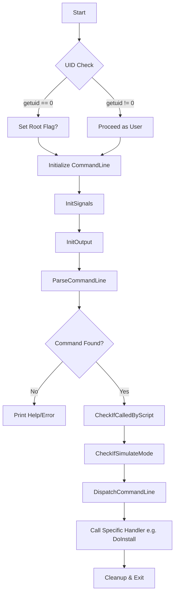

# Control Flow Logic: apt binary

## Program Start (Entry Point)
1.  **Entry (0x8234):**
    *   Call `__libc_init`.
    *   Pass `main` address, `argc`, `argv`, and initialization/finalization pointers.

## Main Function (0x8334)


## Command Dispatch Logic
The `DispatchCommandLine` function uses a static array of `Dispatch` structures:
```cpp
struct Dispatch {
    const char* Match;       // e.g., "install"
    bool (*Handler)(CommandLine&); // e.g., &DoInstall
    const char* Description; // e.g., "install packages"
};
```
The program iterates through this table, compares the command string parsed from `argv`, and executes the associated function pointer.

## Argument Parsing
The `ParseCommandLine` routine:
1.  Reads configuration files (e.g., `/etc/apt/apt.conf`).
2.  Parses environment variables.
3.  Overrides settings with command-line flags (e.g., `-y`, `-q`).
4.  Extracts the "Action" (the command) and the "Arguments" (package names).
